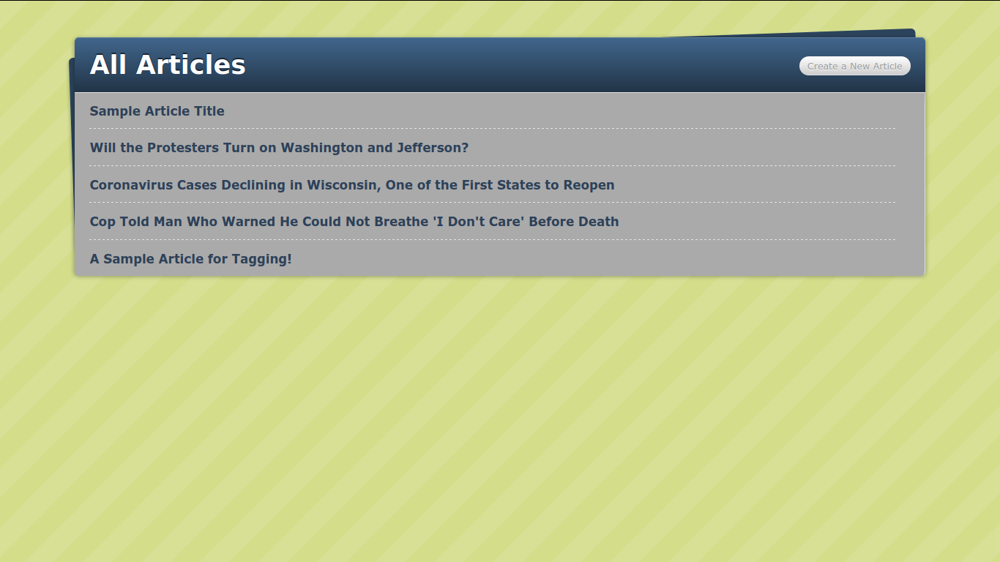

# Blog App
The main objective of this project is to become familiar with the creation of a rails application. the basic concepts behind like models, controllers, views, active records and how to deploy the application.

You can add, delete, modify and view articles. For each of the articles you can add tags, comments or image apart from the title and body of the article. Talking about Tags you can see the articles related to a tag or see the list of tags.

## :package: Built With

    - Ruby
    - Ruby on Rails
    - Heroku

## :mag: Live Demo

[Live Demo Link](https://afternoon-escarpment-27249.herokuapp.com/)

## :busts_in_silhouette: Author

👤 **Martin Cervantes**

- Linkedin: [Martin Cervantes](https://www.linkedin.com/in/cervantesmartin/)
- Twitter: [@M4rt1nC3rv4nt3s](https://twitter.com/M4rt1nC3rv4nt3s)
- Github: [@mcervantes71](https://github.com/mcervantes71)
- Gmail: [cervantes.martine](mailto:cervantes.martine@gmail.com)

## 🤝 Contributing

    Contributions, issues and feature requests are welcome!

Feel free to check the [issues page](../../issues).

## :star2: Show your support

    Give a ⭐️ if you like this project!

## 📝 License

This project is [MIT](lic.url) licensed.
